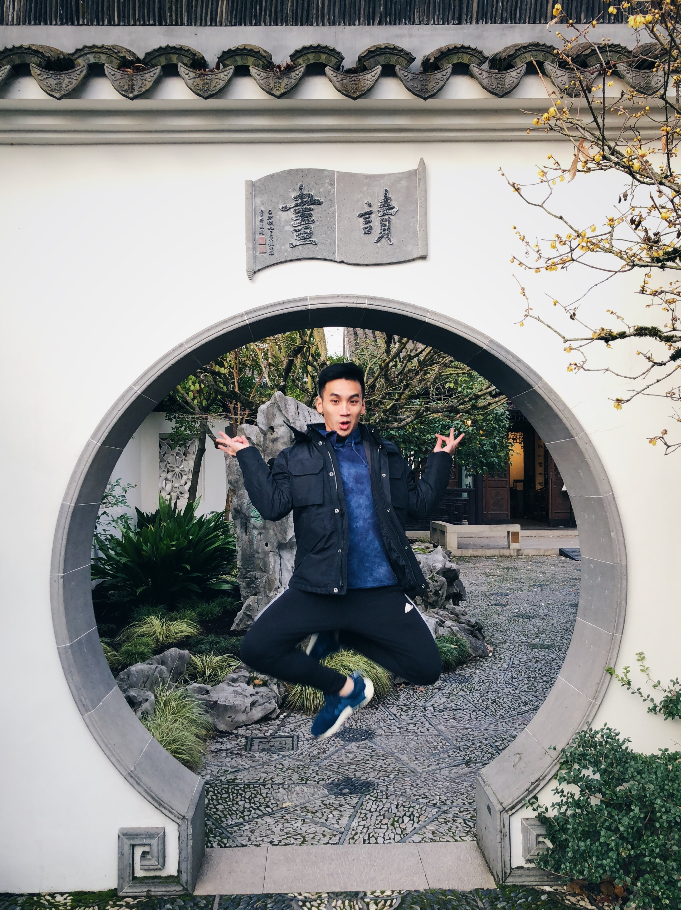

<h3 align="center"> Hi there 👋 Here is something about myself if you are exhausted from reading codes </h3>

  

- 🤔 My name is **Duong Vu**, and friends usually call me **Daniel**
- 🎓 I'm from Class of 2020 in `UC Irvine` with B.S in Computer Science 1️⃣ 1️⃣ 1️⃣ 1️⃣ 1️⃣ 1️⃣ 0️⃣ 0️⃣ 1️⃣ 0️⃣ 0️⃣
- 🔭 I’m currently a Backend Software Engineer in `Organic Search and Personalization Team` at [Tiki Corporation](https://www.crunchbase.com/organization/tiki-vn)
- 🌱 I’m also learning `AWS` and `Django` as an AI Engineer Intern at [IPMD, Inc.](http://www.ipmdinc.com/project-m.html) 
- 📫 How to reach me: **vudh1@uci.edu**
- 💬 Ask me about mechanical keyboards and basketball 🏀
- 😄 Fun fact: My PokemonGo Trainer Code is 1217 9669 9915. Yes, I can be multitasking between finding bugs and Pikachus ⚡

